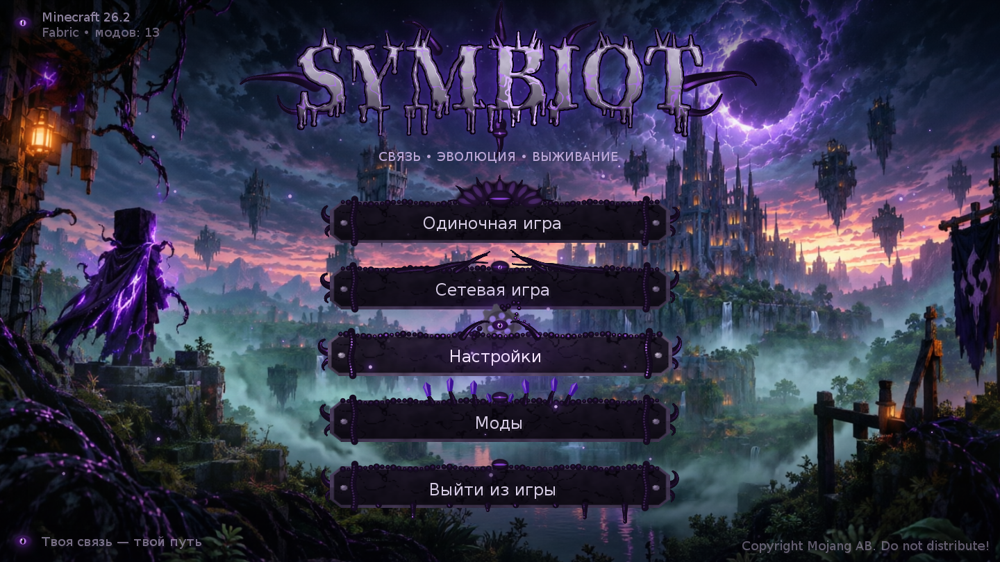

# Symbiot Menu — живое главное меню для Minecraft 26.2 (Fabric)

Клиентский мод, заменяющий ванильное главное меню на анимированное меню в стиле тёмного фэнтези.



**v0.2 (тест):** фон — нарисованный мастер-кадр `master.png` с живыми эффектами поверх (сдвиг за мышью, пульс сияния луны, молнии, мерцание фонарей, туман). Логотип и кнопки пока процедурные.

## Что внутри

**Фон (v0.1, процедурный)** — многослойный стилизованный Minecraft-мир с параллаксом от мыши: небо с облаками и звёздами,
луна-затмение с вращающейся короной и пульсирующим сиянием, блочный замок со светящимися окнами,
летающие острова, озеро с отражениями, два слоя плывущего тумана, мерцающие фонари, фиолетовые споры.

**Симбиот живой** — все щупальца процедурные: постоянно медленно изгибаются, по прожилкам бежит пульс.

**Кнопки** — каменные плиты, облепленные живой тканью (лента по верхнему краю, «обхваты» у краёв,
по два щупальца на концах). У каждой своя форма нароста:

| Кнопка | Форма симбиота |
|---|---|
| Одиночная игра | массивный панцирь из пластин с шипами и глазом в центре |
| Сетевая игра | три пары тонких щупалец тянутся друг к другу, между кончиками проскакивают искры |
| Настройки | симбиот обвивает вращающуюся металлическую шестерню |
| Моды | отростки, из которых прорастают фиолетовые кристаллы |
| Выйти из игры | симбиот стекает вниз каплями, будто отпускает игрока |

**При наведении:** щупальца ускоряются, появляется фиолетовое свечение, глаз/ядро открывается
(и следит за курсором, иногда моргает), прожилки начинают ярко пульсировать, пластины панциря
приподнимаются, кристаллы растут и светятся, шестерня крутится быстрее.

**При нажатии:** симбиот резко сжимается вокруг кнопки (щупальца укорачиваются и закручиваются,
плита «вдавливается»), фиолетовая вспышка — и открывается нужный экран.

**Логотип:** отростки вокруг букв шевелятся, по буквам периодически пробегает волна фиолетовой энергии,
прожилки тихо мерцают, под логотипом — глаз.

**Прочее:** локализация ru_ru / en_us / uk_ua, управление с клавиатуры (↑/↓/Tab + Enter/Пробел),
кнопка «Моды» открывает Mod Menu, если он установлен, иначе — встроенный список модов в том же стиле.

## Установка

Нужно: Minecraft **26.2**, Fabric Loader **≥ 0.19.3**, **Fabric API** для 26.2, Java 25.
Положите `symbiot-menu-0.2.0+26.2.jar` в папку `mods`. Язык кнопок следует языку игры
(Настройки → Язык → Русский).

## Сборка jar

### Вариант 1 — без установки чего-либо (GitHub Actions)
1. Создайте репозиторий на GitHub и загрузите в него содержимое архива.
2. Откройте вкладку **Actions** — сборка запустится сама (файл `.github/workflows/build.yml`).
3. Через ~3–5 минут скачайте артефакт **symbiot-menu** — внутри готовый `.jar`.

### Вариант 2 — локально
Установите JDK 25 и Gradle 9.5.1 (или откройте папку в IntelliJ IDEA как Gradle-проект), затем:
```
gradle wrapper      # один раз, создаст gradlew
./gradlew build     # Windows: gradlew.bat build
```
Готовый файл: `build/libs/symbiot-menu-0.2.0+26.2.jar`.
Запуск игры для теста прямо из проекта: `./gradlew runClient`.

## Настройка / изменение

* Фон: замените `textures/gui/master.png` (сейчас 1664×928). Если поменяется компоновка, поправьте координаты луны, фонарей и тумана в начале `render/Background.java` — они заданы в долях кадра.

* Все текстуры генерируются скриптом `tools/gen_assets.py` (Python 3 + Pillow + NumPy) —
  цвета, замок, логотип и т.д. можно поменять там и перегенерировать. Можно и просто заменить PNG
  в `src/main/resources/assets/symbiotmenu/textures/gui/` своими (размеры указаны в `render/Tex.java`).
* Тексты кнопок — `src/main/resources/assets/symbiotmenu/lang/ru_ru.json`.
* Формы симбиота и анимации — `render/SymbiotButton.java`, фон — `render/Background.java`,
  раскладка и логотип — `screen/SymbiotTitleScreen.java`.

## Структура

```
src/main/java/dev/symbiot/menu/
  SymbiotMenuClient.java      точка входа + страховочная подмена меню
  mixin/GuiMixin.java         подмена TitleScreen в Gui.setScreen
  screen/SymbiotTitleScreen   главное меню
  screen/SymbiotModListScreen встроенный список модов
  screen/ModsScreens          выбор: Mod Menu или встроенный список
  render/Tentacle             процедурное щупальце (изгиб, прожилки, пульс, свечение)
  render/Eye                  глаз/ядро (открытие, моргание, слежение за курсором)
  render/SymbiotButton        кнопка и 5 форм симбиота
  render/Background           фон с параллаксом
  render/Spores, Draw, Tex    частицы, примитивы, текстуры
```

## Совместимость с API 26.2

Код написан под новый GUI-API 26.x (`GuiGraphicsExtractor`, `extractRenderState`, `gui.setScreen`,
`Identifier`, `MouseButtonEvent`/`KeyEvent`) и неремапнутый Loom. Если при сборке компилятор укажет
на расхождение сигнатуры (Mojang часто переименовывает методы между версиями), все обращения к игре
собраны в нескольких местах: `render/Draw.java` (отрисовка), `screen/*` (экраны и ввод),
`mixin/GuiMixin.java` (подмена меню).
